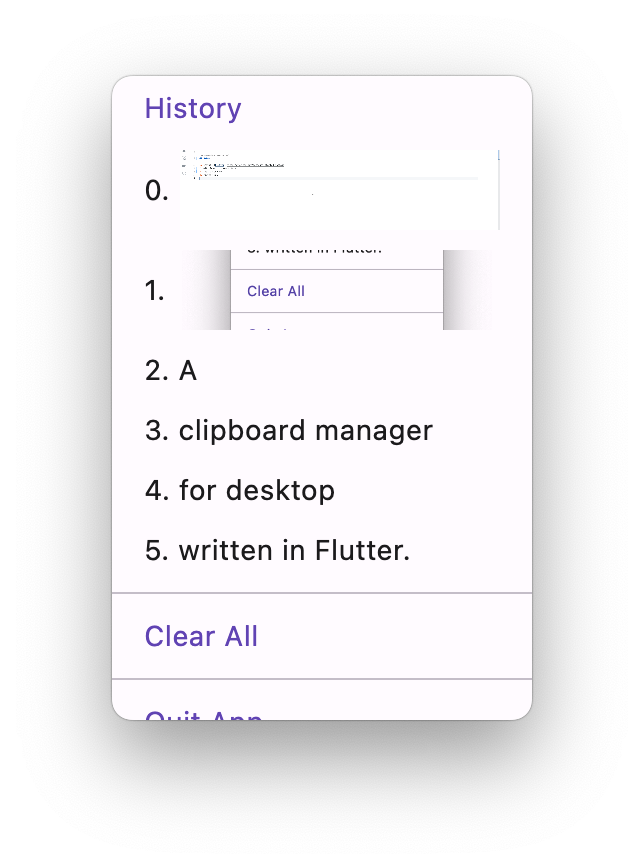

# flutter_pasteboard

A clipboard manager for desktop written in Flutter.

| macOS | Windows | Linux |
| :---: | :---: | :---: |
| ✅ | ❌ | ❌ |

## Screenshots

## Setup

1. Install [Flutter](https://flutter.dev/docs/get-started/install)
2. git clone this repository
3. flutter pub get
4. flutter run
